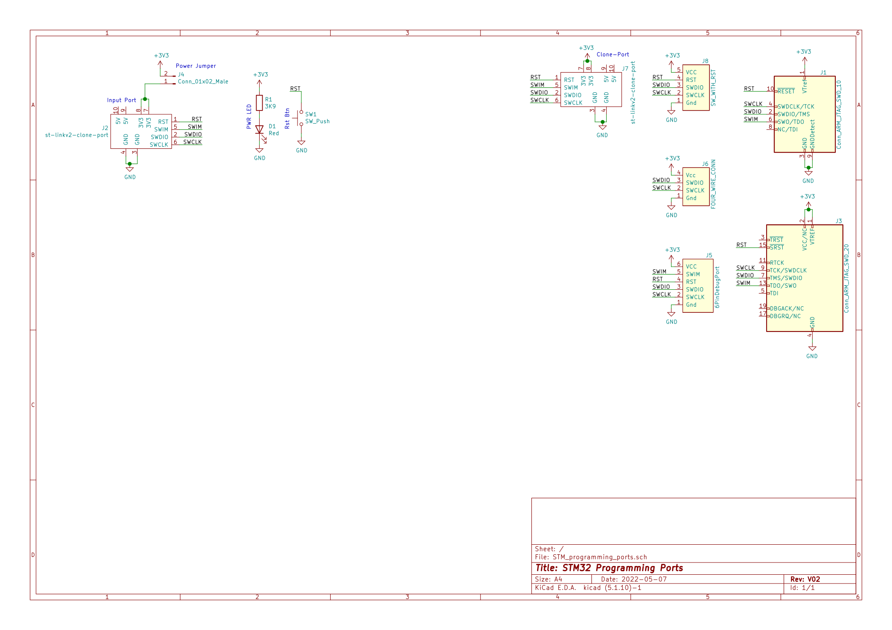
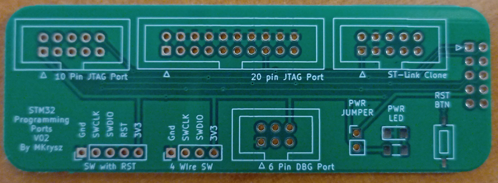
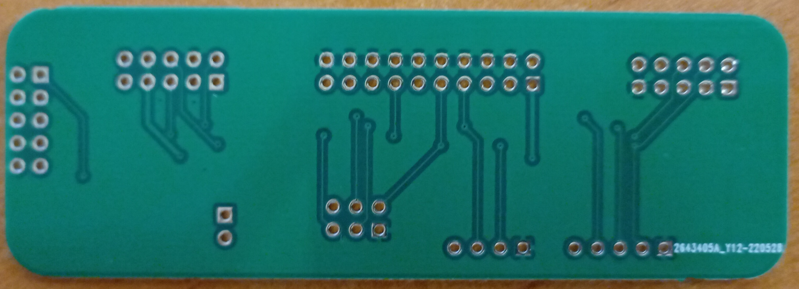
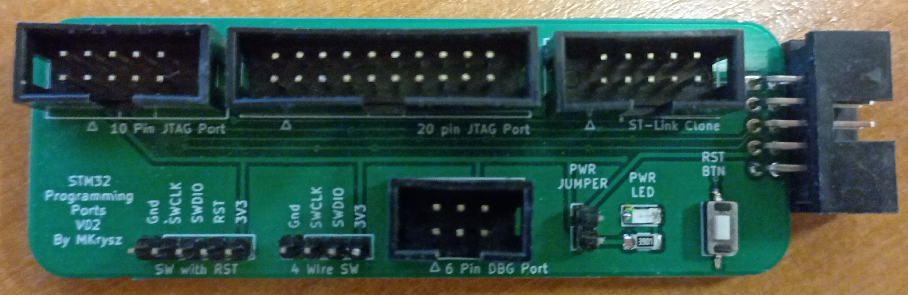

# STM32 Programming Port

## About

<!-- While making project using STM32 MCUs I always find it infuriating that I lose so much time and effort on something so mundane as  -->
The goal of this project is to convert ports found in those cheap ST-Link programmers to other useful ports like, standard 20-pin ARM JTAG connector or typical 4-pin Single Wire connector commonly found in chinese STM32-based development boards. As additional features I added a reset button and power jumper.

## Schematic

## PCB

### Before assembly

### After assembly

